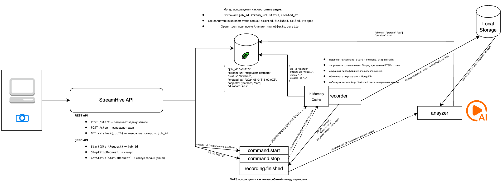

# StreamHive

**StreamHive** — платформа для записи и обработки RTSP-видеопотоков с локальным хранением, API-доступом, событийной интеграцией через NATS и расширяемой системой аналитики.

---

## Основные возможности

### 1. Запись RTSP-видеопотоков

* Подключение к любому RTSP-источнику (IP-камерам)
* Запись с помощью `ffmpeg` в локальное хранилище
* Уникальный `job_id` для отслеживания каждой задачи

### 2. API для управления задачами

* **REST API**:

   * `POST /start` — запуск записи
   * `POST /stop` — остановка записи
   * `GET /status/{jobID}` — текущий статус задачи
* **gRPC-сервис**:

   * Методы `Start`, `Stop`, `GetStatus` с protobuf-контрактом (`streamhive.proto`)

### 3. Событийная архитектура через NATS

* Асинхронное управление задачами:

   * `command.start` — инициирует запись
   * `command.stop` — завершает запись
* Публикация статусов:

   * `recording.finished`

### 4. Хранение и ротация видеофайлов

* Сохраняются на диск в указанную директорию (`STORAGE_PATH`)
* Автоматическая очистка по TTL (`STORAGE_RETENTION`)

### 5. Хранение состояния задач

* Используется MongoDB 
* Каждая задача содержит: `job_id`, `stream_url`, `status`, `created_at`, `objects`, `duration`

### 6. Интеграция видеоаналитики

* Отдельный сервис analyzer (Go + Python)
* Подписка на `recording.finished`
* Обработка видео с ML/AI моделью (YOLO)
* Публикация результата в MongoDB

---

## События nats

| Subject              | Отправитель   | Пример Payload                                                               | Описание                          |
|----------------------|---------------|------------------------------------------------------------------------------|-----------------------------------|
| `command.start`      | REST/gRPC API | ```{ "stream_url": "rtsp://camera.local/live" }```                           | Инициирует задачу записи с камеры |
| `command.stop`       | REST/gRPC API | ```{ "job_id": "abc123" }```                                                 | Останавливает задачу записи       |
| `recording.finished` | Recorder      | `"abc123"`                                                                   | Уведомление о завершении записи   |
| `video.analyzed`     | Analyzer      | ```{ "job_id": "abc123", "objects": ["person", "car"], "duration": 12.4 }``` | Результат видеоаналитики          |

---

## Архитектура платформы



---

## Поддержка docker-compose

```bash
docker-compose up --build
```
